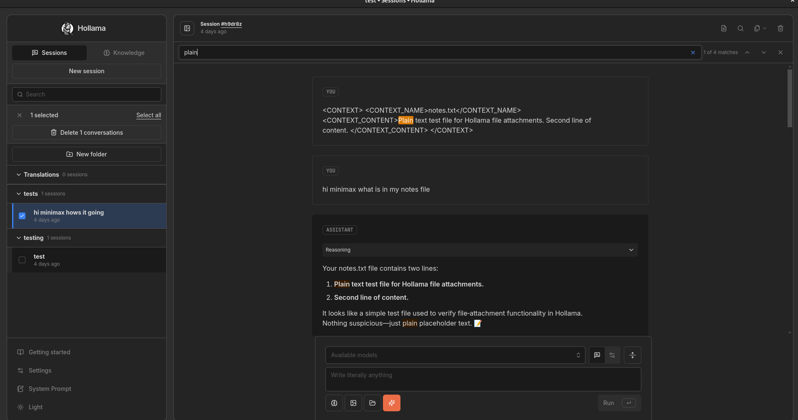
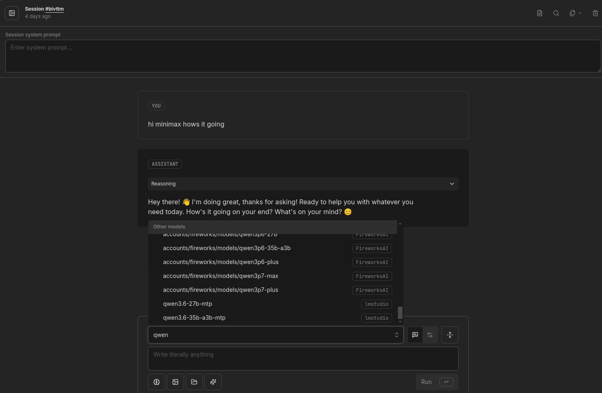
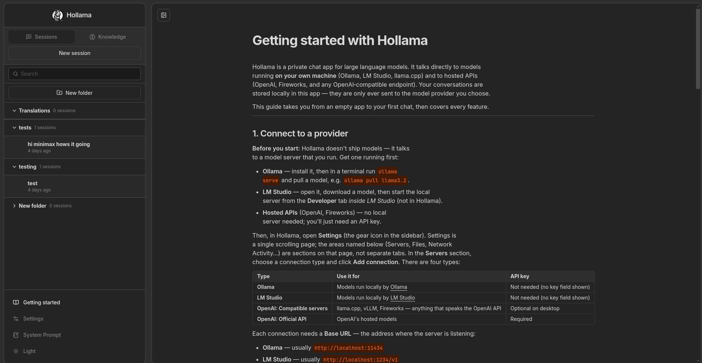
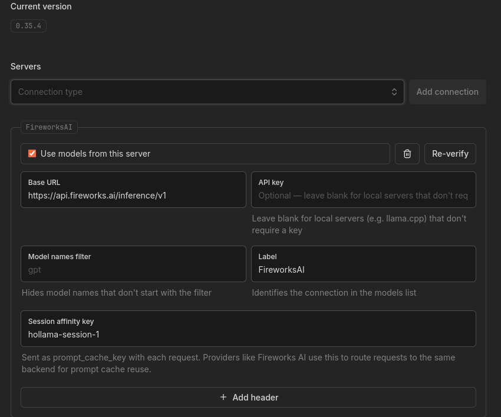
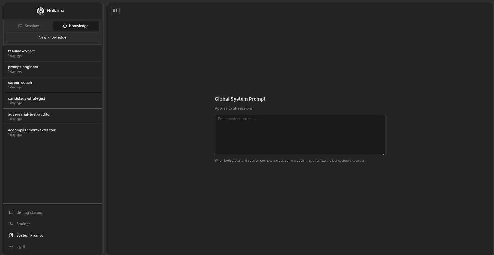
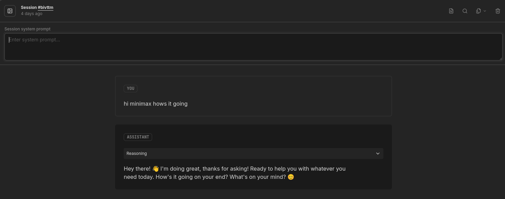
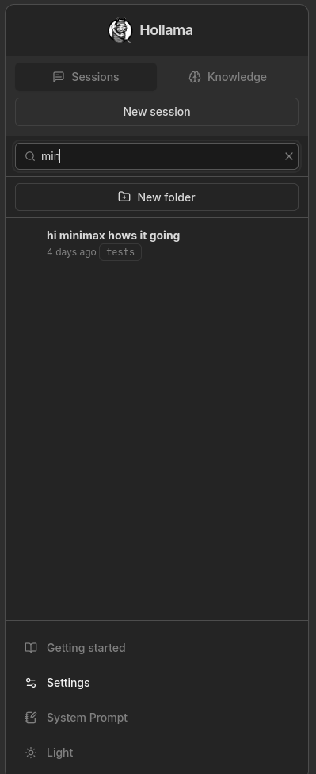
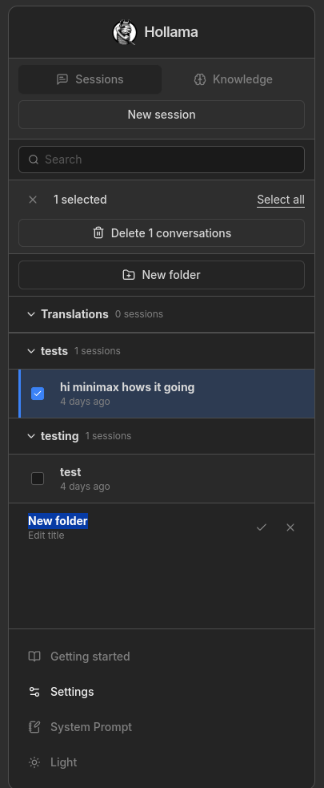
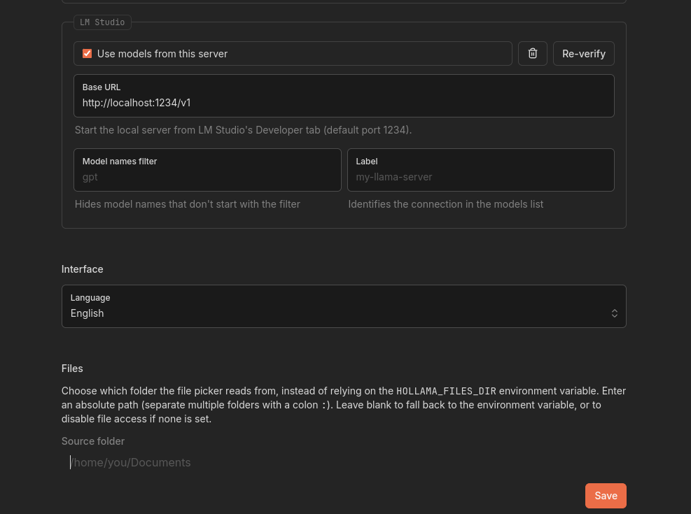

# Hollama-ULTIMATE

A feature-packed, privacy-first chat app for large language models. Connect to Ollama, LM Studio, OpenAI, Fireworks, or any OpenAI-compatible endpoint — all from one interface with folders, search, file attachments, reasoning support, and a full security model that keeps your keys off the browser.

Built on [Hollama](https://github.com/fmaclen/hollama) and extended with 16,000+ lines of new features, tests, and hardening.

|  |  |
| --- | --- |
|  |  |
|  |  |

---

### What's new over upstream Hollama

This isn't a patch — it's a ground-up expansion. Upstream Hollama supports Ollama and OpenAI with browser-direct API calls. This fork adds:

**5 provider types, one unified picker**
- Ollama, LM Studio, OpenAI, Fireworks, and any OpenAI-compatible server (vLLM, llama.cpp, etc.)
- Connect multiple servers at once — models from every provider appear in a single picker, labeled by connection
- Reasoning model support across all providers with collapsible reasoning traces
- Session affinity keys for Fireworks prompt cache reuse

**Folder organization**
- Create folders, rename them inline, drag conversations between them
- Sidebar search filters across all folders with folder badges on results
- Multi-select with checkboxes for batch delete

**In-conversation search**
- Ctrl/Cmd+F opens a search bar scoped to the current conversation
- Matches highlighted across all messages with prev/next navigation

**File attachments**
- Attach files from configurable source directories — content is injected as context
- File picker with directory browsing, configurable from Settings or environment variable

**System prompts**
- Global system prompt that applies to every session
- Per-session system prompt override — set instructions for a single conversation
- Both work together: the model receives global first, then session-specific

**Conversation export**
- Copy as Markdown, copy as JSON, or download as `.md`
- Copy individual messages or entire sessions

**Privacy & security**
- Server-side API proxy — API keys never reach the browser
- Credential isolation in `.hollama/credentials.json` (mode `0600`)
- SSRF protection — blocks private IPs, cloud metadata, loopback, IPv4-mapped IPv6
- Strict CSP — no inline scripts, no outbound telemetry, no analytics, no update checks
- Custom headers per connection, stored server-side with a reserved-header blocklist
- Origin checking on all proxy routes

**Desktop**
- Electron builds for macOS, Windows, and Linux
- Secure CORS bypass via `onHeadersReceived` interceptor (no `webSecurity: false`)

**Everything else**
- Large prompt field with code editor toggle
- Markdown rendering with syntax highlighting
- KaTeX math notation
- Edit & retry messages
- Byte-based storage cap with usage warnings
- Light & dark themes
- Responsive layout
- 9 languages (EN, DE, ES, FR, JA, PT-BR, TR, VI, ZH-CN)
- Download Ollama models directly from the UI
- Built-in Getting Started guide
- Import & export all stored data

---

### Get started

- [Quickstart](docs/quickstart.md) — build, run, configure
- [Architecture & docs](docs/overview.md)
- [Self-hosting](SELF_HOSTING.md) with Docker

---

### More screenshots

|  |  |
| --- | --- |
|  |  |
| Fireworks AI config with session affinity keys for prompt caching, API keys stored server-side, and custom headers per connection. | Knowledge base for reusable context. Global system prompt applies to every session. |
|  |  |
| Per-session system prompt — set instructions for one conversation without affecting others. Reasoning traces are collapsible. | Sidebar search filters conversations across all folders. |
|  |  |
| Create folders inline, rename in place. Multi-select sessions with checkboxes for batch operations. | LM Studio connection setup. The Files section configures which directories the file picker reads from. |
