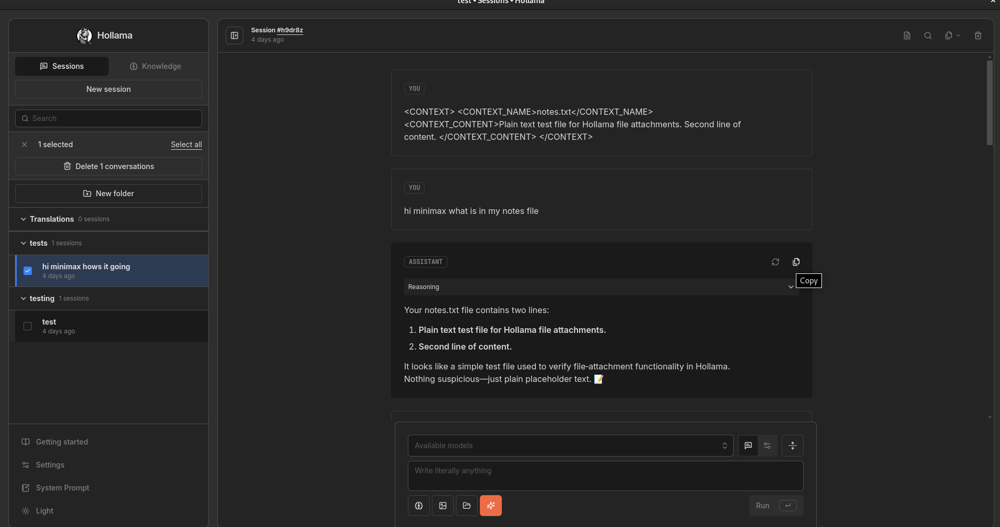

# Hollama Privacy Fork — Overview

This is a privacy-hardened fork of [Hollama](https://github.com/fmaclen/hollama) with Fireworks AI support. It replaces the upstream browser-direct architecture with a server-side proxy so API keys never reach the browser.



## What changed

| Concern | Upstream | This fork |
|---|---|---|
| API calls | Browser-direct via OpenAI SDK (`dangerouslyAllowBrowser: true`) | Server-side proxy (`/api/chat`, `/api/models`) |
| API key storage | `localStorage` in the browser | Server-side credential store, persisted to `.hollama/credentials.json` (mode `0600`) |
| Custom headers | Not supported | `extraHeaders` stored server-side, applied by proxy with `RESERVED_HEADERS` blocklist |
| Telemetry | Plausible analytics, GitHub update checks | Removed entirely; CSP blocks outbound |
| CORS | Electron: `webSecurity: false` | Electron: `onHeadersReceived` interceptor (webSecurity stays `true`) |
| SSRF protection | None | `validateUpstreamUrl` blocks private IPs, cloud metadata, loopback, IPv4-mapped IPv6 |
| Fireworks models | Broken (`GET /v1/models` returns 500) | Proprietary endpoint fallback with pagination + `probeChat` verify |
| System prompts | Knowledge-based only | Free-text system prompt field + knowledge system prompt |
| Reasoning | Not supported | `reasoning_effort` parameter + `reasoning_content` SSE parsing for Fireworks |
| Prompt caching | Not supported | `prompt_cache_key` via `sessionAffinityKey` for OpenAI-Compatible providers |

## Architecture

```
Browser                          SvelteKit Server                 Upstream API
┌──────────────┐    fetch()     ┌──────────────────┐   fetch()   ┌─────────────┐
│              │───────────────>│ /api/keys        │             │             │
│  Svelte UI   │               │ /api/chat ───────────────────>  │  Fireworks  │
│              │<──────────────│ /api/models ──────────────────> │  OpenAI     │
│  localStorage│  SSE stream   │ /api/metadata     │             │  Ollama     │
│  (sessions,  │               │                   │             │             │
│   settings)  │               │ credentials.json  │             │             │
│              │               │ (API keys +       │             │             │
└──────────────┘               │  extraHeaders)    │             └─────────────┘
                               │                   │
                               │ validateUpstreamUrl│
                               │ sanitizeHeaders    │
                               │ checkOrigin        │
                               │ CSP headers        │
                               └──────────────────┘
```

**Browser holds:** sessions, knowledge, preferences, server metadata (URLs, connection types — no secrets).

**Server holds:** API keys, custom headers, credential persistence. All upstream API calls originate from the server process.

## Key docs

| Doc | What it covers |
|---|---|
| [Architecture](architecture.md) | Proxy endpoints, credential store, request flow, data model |
| [Privacy Changes](privacy-changes.md) | What was removed and added vs upstream |
| [Security](security.md) | SSRF, header sanitization, origin checking, CSP, import validation |
| [Custom Headers](custom-headers.md) | `extraHeaders` feature — storage, sanitization, UI |
| [Session Affinity Key](session-affinity-key.md) | `prompt_cache_key` for Fireworks prompt caching |
| [Fireworks Reasoning](fireworks-reasoning.md) | `reasoning_effort` and `reasoning_content` support |
| [Electron Deployment](electron-deployment.md) | Desktop build, CORS handling, env whitelist |
| [Quickstart](quickstart.md) | Build, run, configure |
| [Testing Guide](testing-guide.md) | Test infrastructure, file inventory, running tests |
| [Network Verification](network-verification.md) | Verifying no unauthorized external requests |
